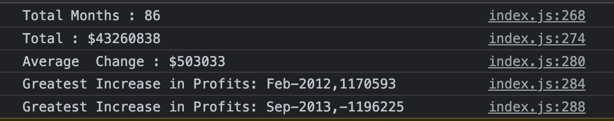

# Console-Finances
This activity presents a real-world situation in which your newfound JavaScript skills will come in handy. You are tasked with creating code for analyzing the financial records of a company.

Feel free to visit the Website below :
https://ian29012.github.io/Console-Finances/

Your task is to write JavaScript code that analyzes the records to calculate each of the following:
◉	The total number of months included in the dataset.
◉	The net total amount of Profit/Losses over the entire period.
◉	The average of the changes in Profit/Losses over the entire period.
◯	You will need to track what the total change in profits are from month to month and then find the average.
◉	(Total/Number of months)
◉	The greatest increase in profits (date and amount) over the entire period.
◉	The greatest decrease in losses (date and amount) over the entire period.